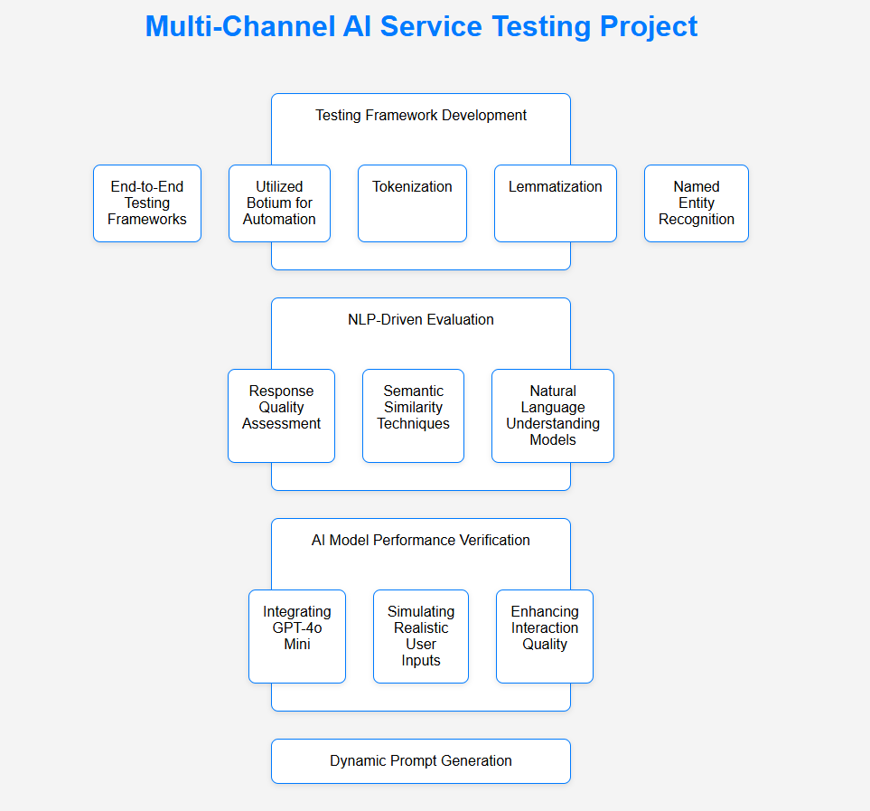

# ai-ml-model-testing
This repository contains the framework and implementations for testing AI/ML models, specifically focusing on conversational AI solutions. The project encompasses various aspects of AI service testing, including multi-channel interactions, risk assessment, and content safety evaluations.

Key Components

**Multi-Channel AI Service Testing Project**
--- Testing Framework Development:

Designed and implemented end-to-end testing frameworks to validate a Conversational AI solution aimed at automating customer interactions for a leading utility provider.
Utilized Botium to develop and execute automated test scripts simulating diverse user interactions, validating conversational flows for both scripted and LLM-powered (GPT-4o-based) chatbot systems across multiple scenarios and platforms.

NLP-Driven Evaluation: Applied advanced NLP techniques such as tokenization, lemmatization, named entity recognition, intent classification, and sentiment analysis to evaluate the AI’s contextual understanding.

AI Model Performance Verification: Assessed response quality through semantic similarity techniques (cosine similarity) and Natural Language Understanding models.

Dynamic Prompt Generation: Currently integrating GPT-4o Mini to simulate realistic user inputs, enhancing interaction quality and ensuring the completeness and appropriateness of responses.

**AI Red Teaming Agent – Azure Implementation**

Red Teaming Framework in Azure AI Studio: Leading the implementation of an AI Red Teaming Agent using Microsoft Azure AI Studio, focusing on risk assessment and safety evaluation of LLMs.

Scenario Coverage with Red Teaming Datasets: Utilized Microsoft’s pre-built red teaming datasets and developed custom attack prompts targeting misinformation, hate speech, self-harm encouragement, malicious content generation, and jailbreak attempts.

Custom Evaluation Logic & Policy Checks: Extended the red teaming agent with custom evaluator logic and policy enforcement mechanisms to align with organizational and ethical standards.

Automated Prompt & Response Evaluation: Automated red teaming workflows using predefined prompt templates and dynamic scenario generation, evaluating responses for toxicity, bias, data leakage, and misuse potential using Azure Content Safety APIs.

Monitoring, Scoring, and Feedback Loop: Captured prompt-response pairs in structured logs, including severity ratings and category tags, ingested into monitoring pipelines via Azure Monitor and visualized through dashboards.

**AI Content Safety Testing**

Risk-Based Evaluation Using PyRIT: Executed AI content safety tests with PyRIT, addressing sensitive content domains such as hate speech, violence, self-harm, misinformation, and bias through targeted scripts and model behavior validation against ethical and regulatory standards.

Custom Scoring Framework: Designed a severity-based scoring system using machine learning and Azure Content Safety guidelines to evaluate AI responses from a user risk perspective, with scoring ranging from 1–5 to quantify threat levels.

Audit-Ready Logging and Reporting: Structured results in JSON format for traceability and compliance, logging detailed prompt-response mappings, severity classifications, and decision outcomes to support audit and risk reporting requirements.
